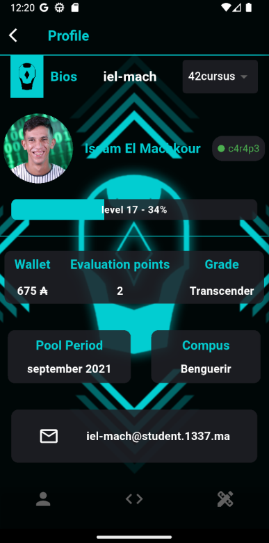
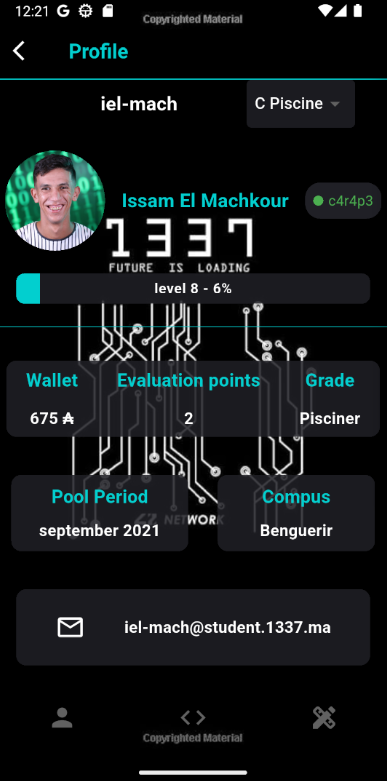
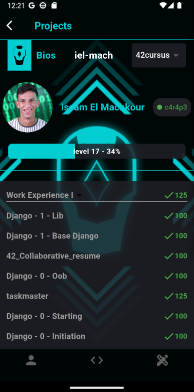
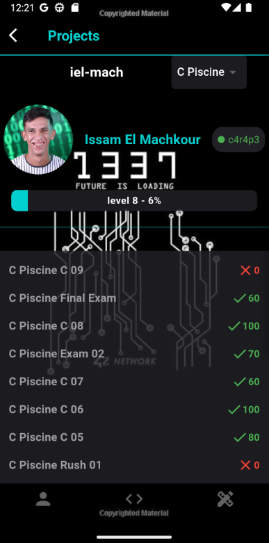
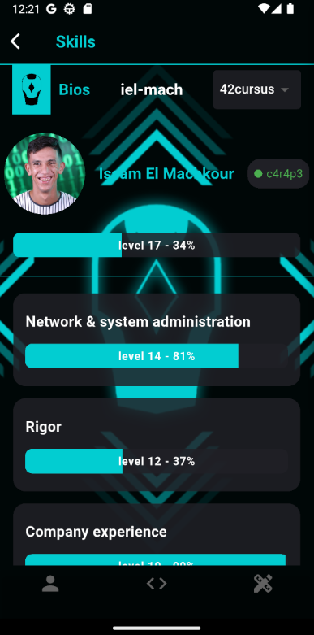
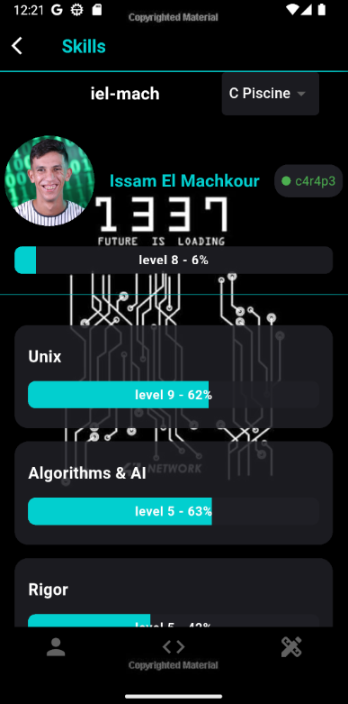

# Swifty Companion

## 📱 Project Overview

This application uses Flutter and the official 42 Intra API to:

- Authenticate users using OAuth2.
- Search and display user profiles by login.
- Retrieve key details such as level, location, wallet, skills, and completed projects.
- Provide a smooth and responsive UI adaptable to different screen sizes.

## 🎯 Goals

This project aims to help you become familiar with:

- Mobile programming (in Flutter).
- The 42 Intra API and OAuth2 authentication.
- Working with IDEs like Android Studio or Visual Studio Code.
- Building responsive and modern mobile UIs.
- Proper error handling and secure development practices.

## 🚀 Features

### ✅ Mandatory Features

- 🔐 OAuth2 authentication using the 42 API (no token per request).
- 📱 At least 2 views/screens:
  - Home/Login screen: where users can enter a login.
  - Profile screen: displays the user’s information.
- ⚠️ Error handling for cases such as:
  - User not found
  - Invalid login
  - Network issues
- 🧑 User details shown:
  - Login
  - Email
  - Coalition
  - Level
  - Location
  - Wallet balance
  - Profile picture
- 🧠 Skills with level and percentage.
- 📁 Completed and failed projects.
- 🔁 Navigation between views.
- 📐 Responsive layout with flexible design techniques for different screen sizes.

### 🌟 Bonus Features (if mandatory is perfect)

- 🔄 Token auto-refresh upon expiration using OAuth2 refresh token flow.

## 🔒 Security

- DO NOT commit any sensitive data.
- Use a `.env` file to store credentials and keys.
- Ensure `.env` is added to your `.gitignore`.
- Never expose your API secrets, tokens, or client credentials.

## 🧰 Tech Stack

- Language: Dart  
- Framework: Flutter  
- API: 42 Intra API (OAuth2)  
- IDE: Android Studio / VS Code  

## 🛠️ Setup & Installation

Clone the repo:

```bash
git clone https://github.com/yourusername/swifty-companion.git
cd swifty-companion
```
Navigate to the project folder:
```bash
cd  Swifty-Companion
```
Create .env file:
```bash
API_BASE_URL=https://api.intra.42.fr
clientId=<your_client_id>
clientSecret=<your_secret_id>
redirectUri=<your_redirect_Uri>
customScheme=<your_custom_Scheme>
```
Install dependencies:
```bash
flutter pub get
```
Run the app:
```bash
flutter run
```

## 📸 Screenshots
### Search Screen

### Profile Cursus Screen

### Profile Pool Screen

### Projects Cursus Screen

### Projects Pool Screen

### Skills Cursus Screen

### Skills Pool Screen

## 📄 License
This project is for educational purposes within the 42 Network and follows all relevant privacy and legal guidelines.
## ✍️ Author
Made with 💙 at 42 by [iel-mach]
